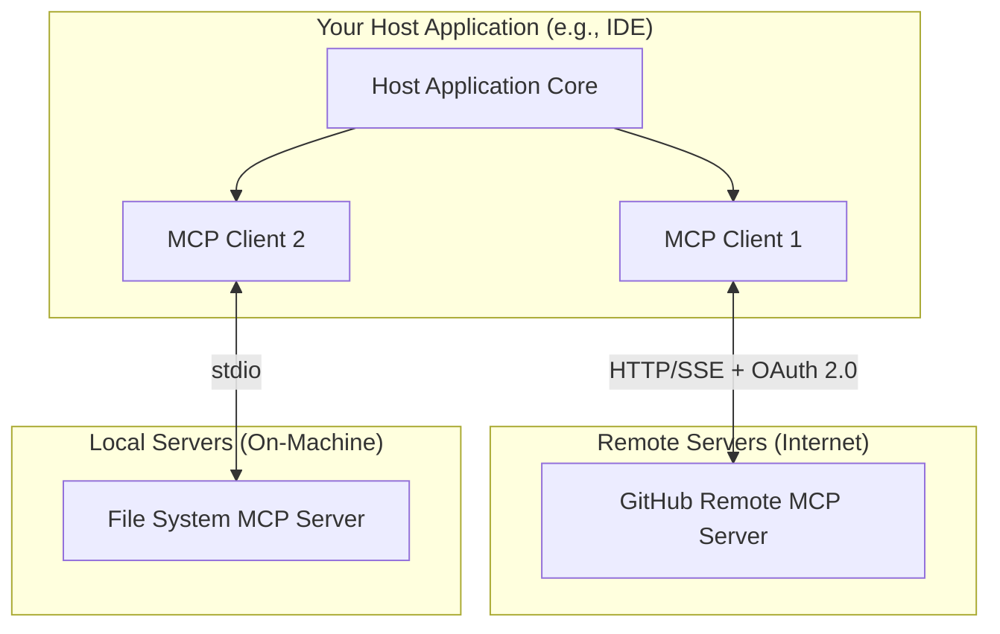

# Building a Host App for the GitHub Remote MCP Server

This guide provides a high-level walkthrough for building host applications that connect to **remote** Model Context Protocol (MCP) servers. We will start with core concepts and then provide a practical, in-depth example of how to integrate with the official GitHub Remote MCP Server.

The goal is to explain the architecture at a high-level, define key requirements, and provide actionable code examples to get you started, while pointing to official documentation for deeper implementation details.

---

## Table of Contents

- [Understanding MCP Architecture](#understanding-mcp-architecture)
- [Part 1: Essential Steps for a Remote Host](#part-1-essential-steps-for-a-remote-host)
  - [Step 1: Implement the Connection (Transport)](#step-1-implement-the-connection-transport)
  - [Step 2: Handle Authentication](#step-2-handle-authentication)
  - [Step 3: Choose Your Authentication Approach](#step-3-choose-your-authentication-approach)
- [Part 2: Guide to GitHub Integration](#part-2-guide-to-github-integration)
  - [Step 1: Create an OAuth-enabled App Using the GitHub UI](#step-1-create-an-oauth-enabled-app-using-the-github-ui)
  - [Step 2: Define Your Configuration](#step-2-define-your-configuration)
  - [Step 3: Implement the OAuth Handshake](#step-3-implement-the-oauth-handshake)
  - [Step 4: Connect to the GitHub Remote MCP Server](#step-4-connect-to-the-github-remote-mcp-server)
  - [Step 5: Execute GitHub Tools](#step-5-execute-github-tools)
- [Handling Organization Access Restrictions](#handling-organization-access-restrictions)
- [Essential Security Considerations](#essential-security-considerations)
- [Additional Resources](#additional-resources)

---

## Understanding MCP Architecture

The Model Context Protocol (MCP) enables seamless communication between your application and various external tools through a standardized client-server architecture.

### High-level Architecture



### Host vs. Client vs. Server

- **Host Application**: The user-facing application you are building. It manages connections to one or more MCP servers and orchestrates tool calls.
- **MCP Client**: A component inside your host application that maintains a 1:1 connection with a single MCP server.
- **MCP Server**: A service that provides access to a specific set of tools. Remote servers, like the GitHub Remote MCP Server, are accessed over the internet and require authentication.

For the full spec, see the [official MCP specification](https://modelcontextprotocol.io/specification/draft).

---

## Part 1: Essential Steps for a Remote Host

### Step 1: Implement the Connection (Transport)

Your host application's MCP client will typically [connect to the GitHub Remote MCP server via HTTP](https://modelcontextprotocol.io/specification/draft/basic/transports#streamable-http).

For implementation details, choose an [MCP SDK](https://modelcontextprotocol.io/sdks) that matches your preferred language and refer to its documentation for transport implementation.

> **Note**: SDK features and documentation vary by language. The TypeScript, Python, and Java SDKs currently provide built-in transport implementations.

### Step 2: Handle Authentication

The GitHub Remote MCP Server requires a valid Authorization token in the `Authorization` header. 

**Supported authentication methods:**
- OAuth 2.0 Authorization Code flow (recommended for host applications)
- Personal Access Tokens (PATs or Fine-grained PATs)
- GitHub App tokens
- Any valid GitHub access token

**Important**: The GitHub Remote MCP Server itself does not provide Authentication services. Your host application must obtain valid GitHub access tokens through one of the supported methods.

### Step 3: Choose Your Authentication Approach

#### Option A: MCP Authorization Discovery (Recommended, standards-compliant)
For applications that want to follow the full MCP specification:
1. Make an unauthenticated request to `https://api.githubcopilot.com/mcp/`
2. Receive a `401` with `WWW-Authenticate` header pointing to discovery endpoints
3. Follow the discovery chain to find OAuth endpoints.
4. Perform OAuth 2.0 using discovered endpoints.

#### Option B: Direct Authentication (simpler)
If you already know you're connecting to GitHub, you can skip discovery and use known endpoints:
- Authorization: `https://github.com/login/oauth/authorize`
- Token exchange: `https://github.com/login/oauth/access_token`

#### Option C: Authentication Using PAT (Not Recommended)
Although not recommended, it is also possible to skip the OAuth flow by providing a GitHub Personal Access Token (PAT) by including an HTTP header similar to the following:
```
Authorization: Bearer <your GitHub PAT>
```


**Note**: Dynamic Client Registration is NOT supported. You must use either a [GitHub App](https://docs.github.com/en/apps/using-github-apps/about-using-github-apps#about-github-apps) or an [OAuth App](https://docs.github.com/en/apps/oauth-apps) on GitHub in order to authenticate using OAuth.  In most cases, this means creating a new App via the GitHub UI.

---

## Part 2: Guide to GitHub Integration

MCP Client Providers are encouraged to create either a [GitHub App](https://docs.github.com/en/apps/using-github-apps/about-using-github-apps#about-github-apps) or an [OAuth App](https://docs.github.com/en/apps/oauth-apps) on GitHub in order to enable clients to authenticate using OAuth.  GitHub does not provide a general purpose App for MCP clients to leverage.

### Step 1: Create an OAuth-enabled App Using the GitHub UI

Detailed instructions for creating a GitHub App can be found at ["Creating GitHub Apps"](https://docs.github.com/en/apps/creating-github-apps/about-creating-github-apps/about-creating-github-apps#building-a-github-app).<br/>
Detailed instructions for creating an OAuth App can be found ["Creating an OAuth App"](https://docs.github.com/en/apps/oauth-apps/building-oauth-apps/creating-an-oauth-app).

For guidance on which type of app to choose, see ["Differences Between GitHub Apps and OAuth Apps"](https://docs.github.com/en/apps/oauth-apps/building-oauth-apps/differences-between-github-apps-and-oauth-apps).

**Key Considerations:**  
- GitHub supports two types of Apps:  [**GitHub Apps**](https://docs.github.com/en/apps/using-github-apps/about-using-github-apps#about-github-apps) and [**OAuth Apps**](https://docs.github.com/en/apps/oauth-apps).
- Tokens provided by **GitHub Apps** are generally more secure because they:
  - include an expiration
  - include support for fine-grained permissions
- **GitHub Apps** must be installed on a GitHub Organization before they can be used.<br/>In some cases, installation must be approved by someone in the Organization with Admin permissions.  For more details, see [this explanation](https://docs.github.com/en/apps/oauth-apps/building-oauth-apps/differences-between-github-apps-and-oauth-apps#who-can-install-github-apps-and-authorize-oauth-apps).<br/>By contrast, **OAuth Apps** don't require installation and, typically, can be used immediately.
- Members of an Organization may use the GitHub UI to [request that a GitHub App be installed](https://docs.github.com/en/apps/using-github-apps/requesting-a-github-app-from-your-organization-owner) Organization-wide.
- While not strictly necessary, if you expect that a wide range of users will use your MCP Client, consider publishing your OAuth-enabled App on the [GitHub App Marketplace](https://github.com/marketplace?type=apps) to ensure that it's discoverable by your audience.


### Step 2: Define Your Configuration

```typescript
// Example configuration for the GitHub integration
export const GITHUB_OAUTH_CONFIG = {
  clientId: process.env.GITHUB_CLIENT_ID,
  clientSecret: process.env.GITHUB_CLIENT_SECRET,
  redirectUri: 'http://localhost:3000/oauth/github/callback',
  scopes: ['repo', 'read:org', 'user:email'],
  authorizationUrl: 'https://github.com/login/oauth/authorize',
  tokenUrl: 'https://github.com/login/oauth/access_token',
  serverUrl: 'https://api.githubcopilot.com/mcp/'
};
```

### Step 3: Implement the OAuth Handshake

Your application must perform the standard Authorization Code flow.

> **Note:**  
> [PKCE (Proof Key for Code Exchange)](https://datatracker.ietf.org/doc/html/rfc7636) is included in the MCP spec. While the GitHub MCP Server currently accepts tokens from OAuth apps without it today, PKCE support will soon be added and become a requirement. We recommend implementing it now to future-proof your integration.

```
// Step 1: Build the authorization URL
const state = crypto.randomUUID(); // Store this in the user's session for CSRF protection

const authUrl = new URL(GITHUB_OAUTH_CONFIG.authorizationUrl);
authUrl.searchParams.set('client_id', GITHUB_OAUTH_CONFIG.clientId);
authUrl.searchParams.set('redirect_uri', GITHUB_OAUTH_CONFIG.redirectUri);
authUrl.searchParams.set('scope', GITHUB_OAUTH_CONFIG.scopes.join(' '));
authUrl.searchParams.set('state', state);

// Redirect user to authUrl.toString()...

// Step 2: In your callback handler, exchange the code for a token
// (First, verify the 'state' parameter matches what you stored in the session!)
const tokenResponse = await fetch(GITHUB_OAUTH_CONFIG.tokenUrl, {
  method: 'POST',
  headers: {
    'Accept': 'application/json',
    'Content-Type': 'application/json'
  },
  body: JSON.stringify({
    client_id: GITHUB_OAUTH_CONFIG.clientId,
    client_secret: GITHUB_OAUTH_CONFIG.clientSecret,
    code: receivedCodeFromCallback,
    redirect_uri: GITHUB_OAUTH_CONFIG.redirectUri
  })
});
const { access_token } = await tokenResponse.json();
```

### Step 4: Connect to the GitHub Remote MCP Server

Once you have an `access_token`, you can establish an authenticated MCP connection.

```
import { Client } from "@modelcontextprotocol/sdk/client/index.js";
import { SSEClientTransport } from "@modelcontextprotocol/sdk/client/sse.js";

const transport = new SSEClientTransport(
  new URL(GITHUB_OAUTH_CONFIG.serverUrl),
  {
    headers: {
      'Authorization': `Bearer ${accessToken}`,
      'User-Agent': 'YourAppName/1.0.0'
    }
  }
);

const mcpClient = new Client(
  { name: "your-app-name", version: "1.0.0" }, 
  { capabilities: {} }
);
await mcpClient.connect(transport);
```

### Step 5: Execute GitHub Tools

With a connected client, you can now call the tools provided by the server.

```
try {
  const result = await mcpClient.request({
    method: "tools/call",
    params: {
      name: "create_issue",
      arguments: {
        owner: "some-org",
        repo: "some-repo",
        title: "New issue created from my MCP Host"
      }
    }
  });

  console.log('Successfully created issue:', result.url);
} catch (error) {
  console.error('Tool execution failed:', error);
}
```

## Handling Organization Access Restrictions
Organizations may block OAuth apps until explicitly approved. If a tool call fails, you can provide actionable next steps for a smooth user experience:

1. Detect the specific error.
2. Notify the user clearly.
3. Depending on their GitHub organization privileges:
    - Org Members: Prompt them to request approval from a GitHub organization admin, within the organization where access has not been approved.
    - Org Admins: Link them to the corresponding GitHub organization’s OAuth App approval settings at `https://github.com/organizations/[ORG_NAME]/settings/oauth_application_policy`

## Essential Security Considerations
- **Token Storage**: Use secure platform APIs (e.g. keytar for Node.js).
- **Input Validation**: Sanitize all tool arguments.
- **HTTPS Only**: Never send requests over plaintext HTTP. Always use HTTPS in production.
- **PKCE:** We strongly recommend implementing [PKCE](https://datatracker.ietf.org/doc/html/rfc7636) for all OAuth flows to prevent code interception, to prepare for upcoming PKCE support.

## Additional Resources
- [MCP Official Spec](https://modelcontextprotocol.io/specification/2025-03-26)
- [GitHub Docs on Creating OAuth Apps](https://docs.github.com/en/apps/oauth-apps)
- GitHub Docs on Installing OAuth Apps into a [Personal Account](https://docs.github.com/en/apps/oauth-apps/using-oauth-apps/installing-an-oauth-app-in-your-personal-account) and [Organization](https://docs.github.com/en/apps/oauth-apps/using-oauth-apps/installing-an-oauth-app-in-your-organization)
- [MCP SDKs](https://modelcontextprotocol.io/sdk/java/mcp-overview)
- [Managing OAuth Apps at the Organization Level](https://docs.github.com/en/organizations/managing-oauth-access-to-your-organizations-data)
- [Managing Programmatic Access at the Organization Level](https://docs.github.com/en/organizations/managing-programmatic-access-to-your-organization)
